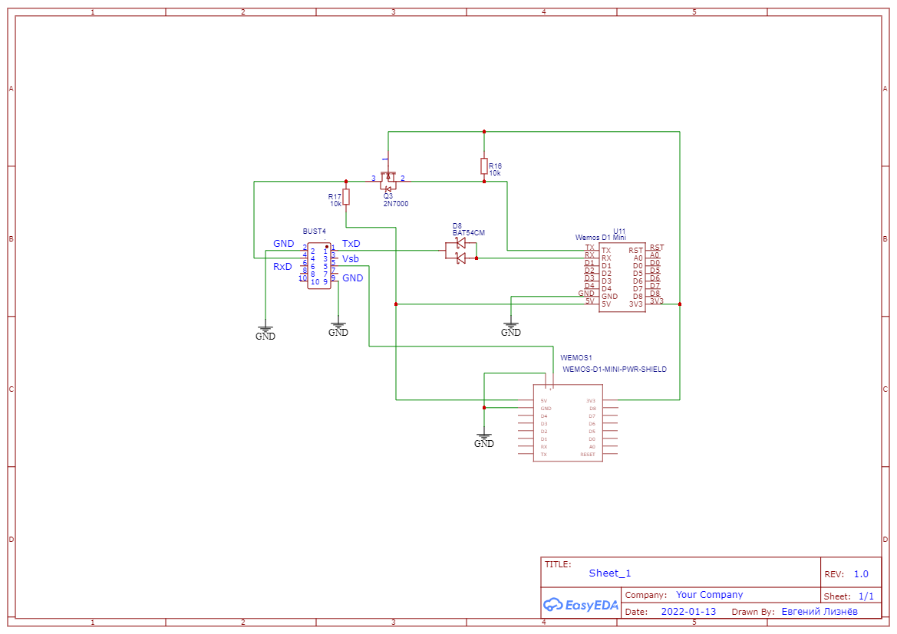
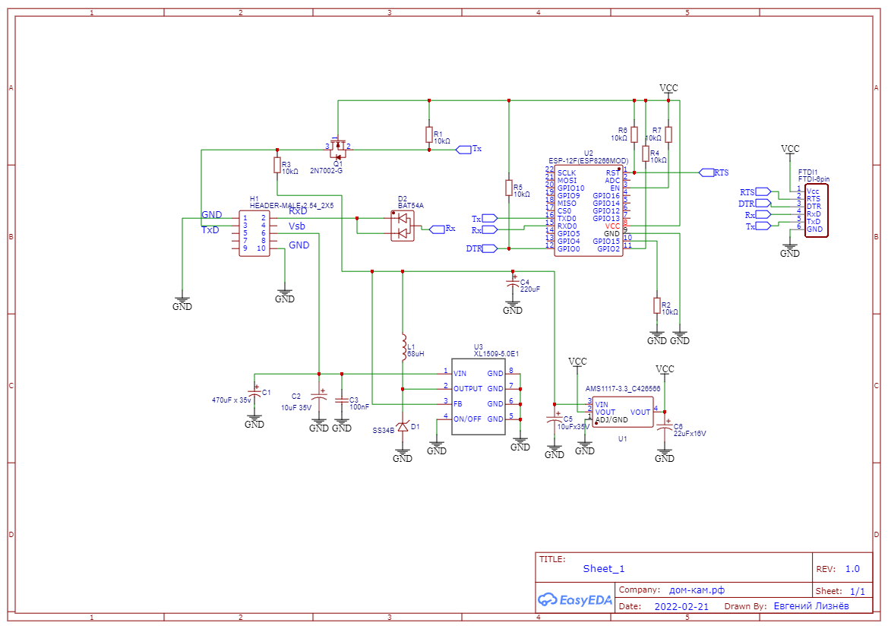
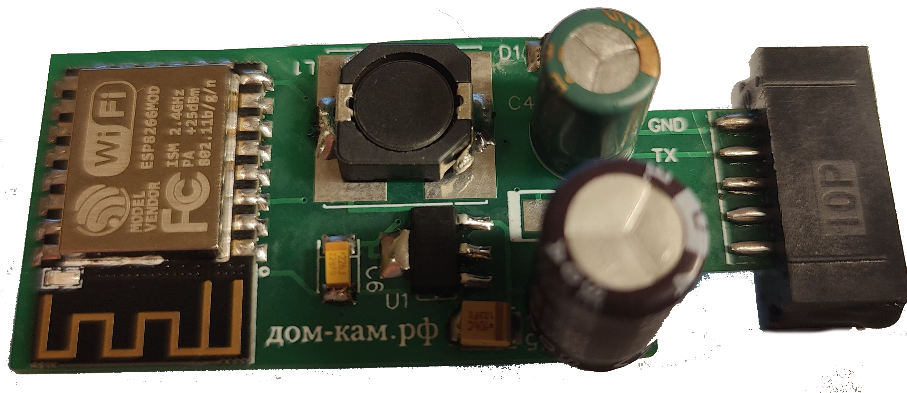
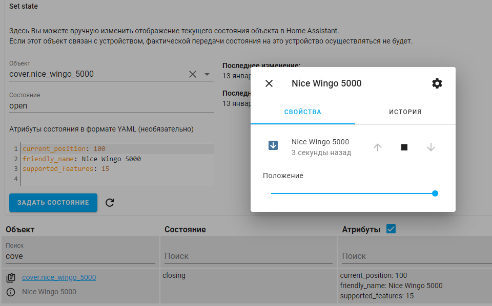
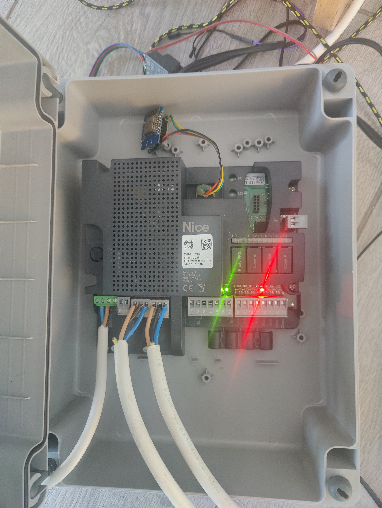
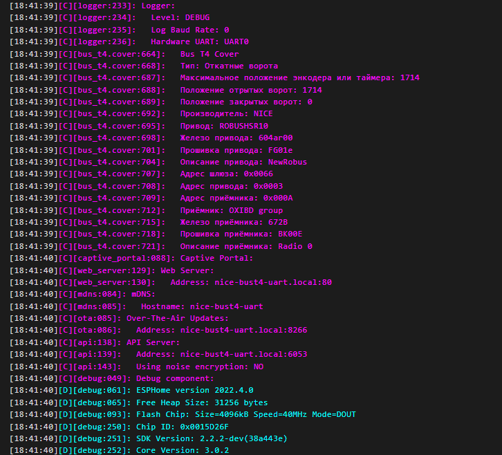
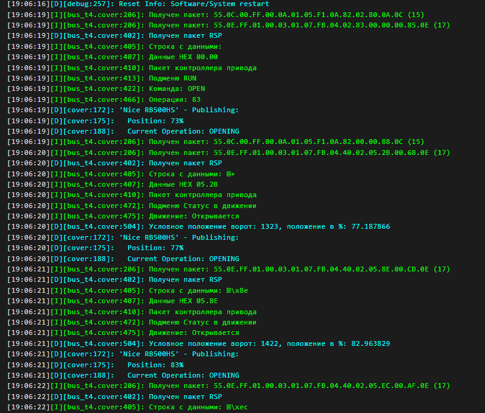

Доступен перевод на английский
[English](https://github.com/xdanik/Nice_BusT4)


# ESPHOME компонент для управления приводами Nice по протоколу Bus T4
# Nice Bus T4 protocol

Появилось желание разобраться в протоколе для управления воротами Nice.
Переспектива - дешёвые устройства на базе esp8266 для управлением из умного дома.

Современные блоки управления приводами имеют разъем BusT4, на который выведены GND, +24V, Can-Rx, Can-Tx. 

# Текущие возможности компонента
* Отправка команд: "Открыть", "Стоп", "Закрыть", "Частичное открытие", "Пошагово (SBS)" и других через кнопки.
* Отправка произвольных HEX команд через службу "raw_command". Команда должна быть сформирована заранее или где-то подсмотрена. Разделителями байт могут быть точки или пробелы. Пример: 55 0c 00 03 00 81 01 05 86 01 82 01 64 e6 0c или 55.0D.00.FF.00.66.08.06.97.00.04.99.00.00.9D.0D
* Формирование и отправка произвольных GET/SET запросов через службу "send_inf_command". Позволяет произвести настройку устройства или получить его статусы.
* Отображение в логе пакетов от всех устройств в сети busT4.

# BusT4:

Это измененный UART 19200 8n1 с uart.break длительностью 519us-590us перед каждым пакетом.
Можно подключать несколько устройств, для этого в физический уровень добавлены трансиверы CAN-BUS.
Физическая передача чаще происходит через CAN трансиверы, но CAN-фреймов нет.

# Что сделано:
* Подключил FTDI232 к GND, Can-Rx, Can-Tx. Пакеты видны и поддаются расшифровке.
* Логическим анализатором увидел форму сигнала и состав посылок, подобрал параметры uart.
* Успешно имитировал считанный пакет через Arduino Mega, привод реагирует.
* Получил команды OPEN CLOSE и тд
* Получил байт статуса привода
* Считал основные команды, частично расшифровал значение байт.
* Собрал прототип устройства, протестировал работу.
* Собрал сниффер для отлова пакетов между OVIEW и устройствами busT4
* Написал компонент, который имеет возможность управлять приводами и приёмниками по протоколу BusT4
* Проверил работу на Wingo5000 c блоком MCA5, Robus RB500HS, SO2000, Rd400, DPRO924.




ESP8266 не совпадает по уровню сигнала с BUS T4, добавить преобразователь уровней 3.3В -> 5В для Tx на транзисторе.
Rx ESP толерантен к 5В, но для стабильной работы нужен диод. У меня работает со случайным германиевым, возможно и кремниевый подойдёт.

В дальнейшем схема была модифицирована.






Компонент поддерживает отправку произвольной команды на привод через службу  ESPHome: nice_bust4_uart_raw_command в Home assystant.
```
SBS:   55 0c 00 03 00 81 01 05 86 01 82 01 64 e6 0c
Open:  55 0c 00 03 05 81 01 05 83 01 82 03 64 e4 0c
Close: 55 0c 00 03 05 81 01 05 83 01 82 04 64 e3 0c
Stop:  55 0c 00 03 00 81 01 05 86 01 82 02 64 e5 0c
```


При старте и работе ESP опрашивает подключенные к шине BusT4 устройства и выводит информацию о них в лог. 



# Обновления
* Добавлены службы в интерфейс компонента для более простого запуска процедуры распознавания длины створки и процедуры распознавания устройств BlueBus не разбирая корпус привода (и даже находясь удалённо).
* Добавлен вывод в лог конфигурации считанные из устройства состояния L1, L2, L3 (Автоматическое
закрывание, Закрыть после
фотоэлемента, Всегда закрывать)
* Улучшена совместимость с приводами DPRO924
* Кнопка СТОП всегда доступна в User Interface объекта

Если проект заинтересовал, вы можете [купить мне пиво или кофе](https://yoomoney.ru/to/4100117927279918)

